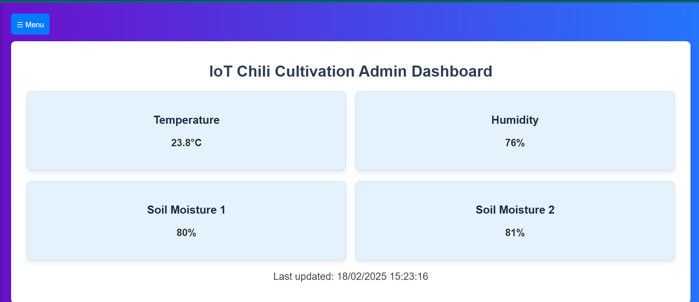

# 🌱 IoT-Based Chili Monitoring System

## 📌 Overview
This project is an IoT-based system for monitoring and automating chili farming using real-time sensor data.

## 🚀 Features
- Real-time monitoring (temperature, humidity, soil moisture)
- Automated irrigation system
- Web dashboard for monitoring
- Data stored in ThingSpeak & MySQL

## 🧠 How it works
1. Sensors collect data (soil moisture, temperature)
2. Arduino processes sensor data
3. NodeMCU sends data to ThingSpeak
4. Web dashboard displays real-time data

## 🛠️ Technologies Used
- Arduino Uno
- NodeMCU (ESP8266)
- PHP, MySQL
- ThingSpeak
- HTML/CSS

## 📊 System Architecture

## 💻 Dashboard

## 📂 Setup Instructions
1. Clone repo
2. Setup database using `database.sql`
3. Configure API key ThingSpeak
4. Run using Laragon/XAMPP

## 📈 Future Improvements
- Mobile app integration
- AI prediction for irrigation